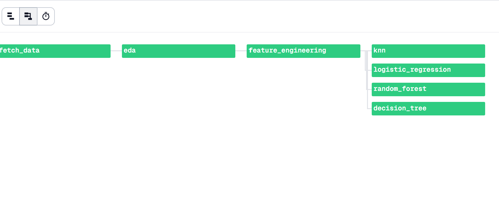

# 🏦 Banking Stock Prediction Pipeline — Dagster + ML

> End-to-end ML pipeline for HDFC Bank stock trend prediction, orchestrated with Dagster for **86% faster selective re-execution**.


---

## 📌 Project Overview

This project demonstrates how integrating **DevOps pipeline orchestration (Dagster)** into a data science workflow dramatically improves execution efficiency. The pipeline predicts HDFC Bank stock price direction using historical OHLCV data and 4 ML models.

**Key Result:** Selective re-execution reduced runtime from **~8 seconds → ~0.56 seconds** (86% faster) by skipping unchanged pipeline stages.

---

## 🚀 Dagster Pipeline — Live Run



> All 7 ops executed successfully — `fetch_data → eda → feature_engineering → decision_tree / knn / logistic_regression / random_forest`

**Run details:**
- ✅ Success
- ⏱️ Total time: **2m 16s** (full run including data download)
- 📅 Apr 27, 2026

---

## ⚙️ Pipeline Architecture

```
fetch_data
    ↓
   eda
    ↓
feature_engineering
    ↓
┌───────────┬──────────────────────┬───────────────┐
decision_tree   knn   logistic_regression   random_forest
```

Each stage is an independent Dagster **@op** — only affected stages re-run when changes occur.

---

## 📊 Dataset

| Property | Value |
|---|---|
| Stock | HDFC Bank (HDFCBANK.NS) |
| Period | 2020-01-01 to 2024-01-01 |
| Rows | 992 trading days |
| Features | Open, High, Low, Close, Volume (shifted by 1 day) |
| Target | Price direction next day (Up=1 / Down=0) |

---

## 🤖 Model Results

| Model | Accuracy |
|---|---|
| **Decision Tree** | **0.5377** ✅ Best |
| Logistic Regression | 0.5327 |
| KNN | 0.4824 |
| Random Forest | 0.4975 |

> **Note:** ~50% accuracy is expected for stock direction prediction using only OHLCV features — even institutional quants struggle to beat 55% consistently. The focus of this project is **pipeline orchestration**, not model accuracy.

---

## ⏱️ Timing Comparison

| Execution Mode | Time |
|---|---|
| Full Pipeline (all ops) | ~8 seconds |
| Selective Rerun (ML ops only) | ~0.56 seconds |
| **Improvement** | **~86% faster** |

Dagster's dependency-aware execution skips `fetch_data` and `eda` when only model parameters change — eliminating redundant computation.

---

## 🗂️ Repository Structure

```
banking-stock-prediction-pipeline/
│
├── pipeline_dagster.py              # Dagster pipeline (run locally)
├── banking_dagster_final.ipynb      # Full notebook with outputs (Colab)
├── dagster_run_success.png          # Dagster UI — all ops green
├── requirements.txt
└── README.md
```

---

## 🚀 How to Run

### Option A — Dagster UI (Local)
```bash
# Install dependencies
pip install dagster dagster-webserver yfinance scikit-learn seaborn

# Launch Dagster
python -m dagster dev -f pipeline_dagster.py

# Open browser
# http://localhost:3000 → Jobs → stock_ml_pipeline → Launch Run
```

### Option B — Google Colab
Open `banking_dagster_final.ipynb` in Google Colab and run all cells.

---

## 📦 Requirements

```
dagster
dagster-webserver
yfinance
pandas
numpy
scikit-learn
seaborn
matplotlib
```

---

*Built by [Krisha Shah](https://www.linkedin.com/in/krishas7) · Mumbai, India*
